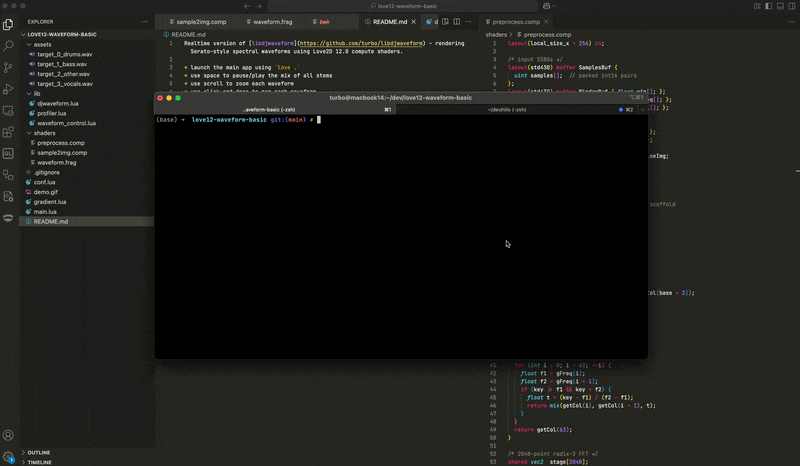

Realtime version of [libdjwaveform](https://github.com/turbo/libdjwaveform) - rendering Serato-style spectral waveforms using Love2D 12.0 compute shaders.

* launch the main app using `love .`
* use space to pause/play the mix of all stems
* use scroll to zoom each waveform
* use click-and-drag to pan each waveform

This makes use of direct SoundData to Buffer copies by packing two 16bit samples into one 32bit uint for the FFT SSBO.

Learn more about Love 12 compute shaders in my blog series: https://code.tc/blog/?q=love2d

License (code): Public Domain or CC0 (your choice)

The demo song Bad Sign by Brad Sucks is licensed under a Attribution-ShareAlike 3.0 International License. This also applies to the derivatives (stems) included as examples in this project.

Serato is a trademark and not affiliated in any way with this project.